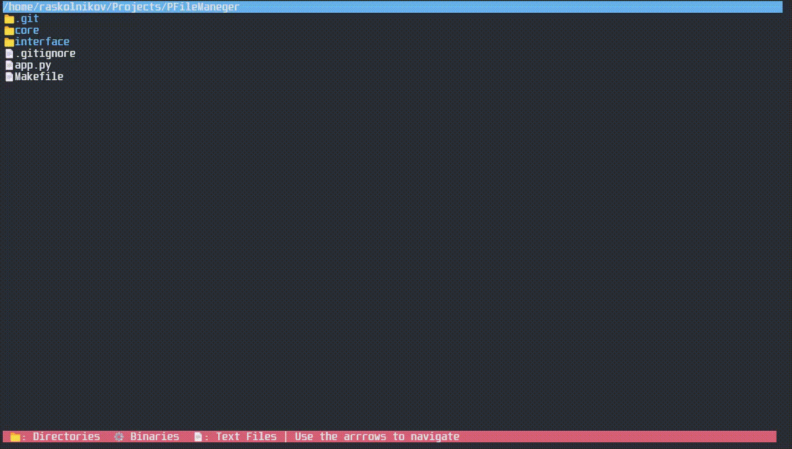

# PFileManager

PFileManager is a terminal-based file manager written in Python. It allows you to navigate directories, view files, and distinguish between directories, text files, and binary files using a simple curses interface.



## Features

- Navigate with arrow keys (↑ ↓ → ←)  
- Visual highlights for directories, text files, and binaries  
- Path bar and footer legend for easy reference  
- No external dependencies (only Python 3 required)

## Installation (Linux)

Install the program:

```bash
sudo make install
```

Run with:
```bash
pyfman
```
